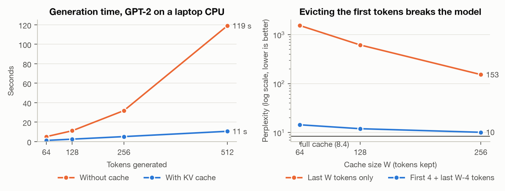

# KV Cache from Scratch

GPT-2 (124M) written from scratch in about 60 lines of PyTorch, a KV cache added to its text-generation loop, and three measurements of what the cache buys and what it costs.

## Results

All numbers from an Apple M2 laptop CPU, float32.

| Measurement | Result |
|---|---|
| Matches Hugging Face's GPT-2 | max logit difference 2e-4; generation with and without the cache gives identical text |
| Generating 512 tokens | 119 s without the cache, 10.6 s with it: **11x faster** |
| Cache memory | 72 KB per token (measured size = formula), 72 MB at 1,024 tokens vs 475 MB of weights |
| Keep only the last 256 tokens | perplexity **153** (full cache: 8.4) |
| Keep the first 4 + the last 252 tokens | perplexity **10.1** |



- **The speedup grows with length.** Without the cache, step *i* processes *i* tokens. Going from 256 to 512 generated tokens made the uncached run 3.7x slower, and the cached run only 2x slower.
- **The first tokens matter more than their content suggests.** Even with a cache of only 64 tokens, keeping the first 4 gives perplexity 14.4 instead of 1,538.

## How it works

### The model ([`gpt2.py`](gpt2.py), `forward`)

The pretrained GPT-2 weights are loaded into a plain dict of tensors, and the model is one function:

```
token embedding + position embedding
-> 12 x [LayerNorm -> multi-head attention -> add, LayerNorm -> MLP -> add]
-> LayerNorm -> multiply by the embedding matrix -> next-token logits
```

### Why a KV cache

A language model writes text one token at a time. To choose token *n+1*, every attention layer compares the new token's **query** against the **keys** of all earlier tokens, then mixes their **values**.

- **Without a cache**, each step feeds the whole sequence back through the model. Generating *n* tokens repeats the work for the first token *n* times, so total work grows with *n²*.
- **The keys and values of earlier tokens never change.** So each layer can store them (the KV cache) and each step only has to process the single new token. Total work grows with *n*.

In code, the whole cache is five lines in `forward`: put the stored keys/values in front of the new ones, then save them back.

Generation therefore has two phases:
- **Prefill:** read the prompt in one pass and fill the cache.
- **Decode:** one token per step, reading from the cache.

### What the cache costs

Every token stores a key and a value vector for every head in every layer:

```
2 (K and V) x 12 layers x 12 heads x 64 dims x 4 bytes (float32) = 73,728 bytes = 72 KB per token
```

For GPT-2 that is modest (72 MB at its full 1,024-token context). For modern models it is the main memory cost of long contexts. Llama-3-8B stores 128 KB per token even in 16-bit, which is about 16 GB for a 128K-token context. That is why so much research goes into shrinking the cache.

### Attention sinks

The simplest way to shrink the cache is a sliding window: keep only the most recent *W* tokens. It fails badly. Language models park a large share of their attention on the **first few tokens** (the "attention sinks" found by Xiao et al., 2024). The softmax has to put its weight somewhere, and the first tokens act as a default. Delete them and the attention pattern falls apart. Keep just the first 4 tokens next to the recent window, and the model behaves normally again.

## Files

| File | What it does |
|---|---|
| [`gpt2.py`](gpt2.py) | The model (`forward`), greedy generation with or without the cache (`generate`), and cache eviction (`evict`). |
| [`test_gpt2.py`](test_gpt2.py) | Checks that the logits match Hugging Face's GPT-2, and that the cache does not change the generated text. |
| [`experiments.py`](experiments.py) | The three measurements and the figure. |
| [`data/stories.txt`](data/stories.txt) | 12 short stories from TinyStories (Eldan & Li, 2023), used as test text. |

## Run

```bash
pip install -r requirements.txt
python test_gpt2.py      # ~30 s
python experiments.py    # ~10 min on a laptop CPU
```

## Limitations

- GPT-2 small, on a laptop CPU, batch size 1, greedy decoding. Absolute timings are specific to this machine.
- The cache grows with `torch.cat` at every step, which copies it. Real inference engines pre-allocate the cache or split it into pages (vLLM's PagedAttention).
- Attention sinks are Xiao et al.'s discovery. This repo reproduces the effect on GPT-2; it does not claim a new result.

## References

- Radford et al. *Language Models are Unsupervised Multitask Learners* (GPT-2). 2019.
- Xiao, Tian, Chen, Han, Lewis. *Efficient Streaming Language Models with Attention Sinks.* ICLR 2024.
- Eldan, Li. *TinyStories: How Small Can Language Models Be and Still Speak Coherent English?* 2023.
