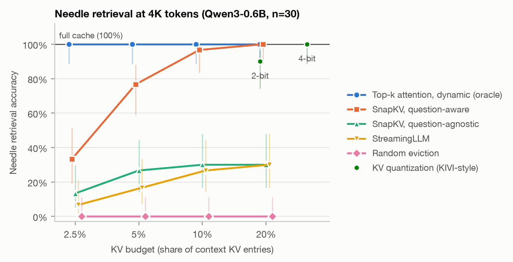
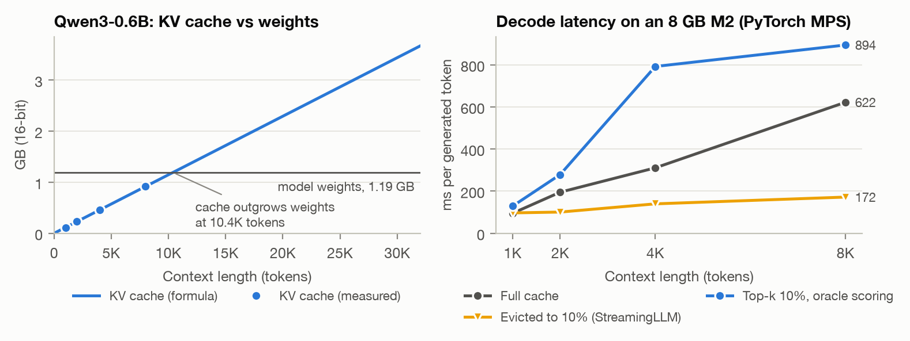

# KV-Cache Lab

**Evict, quantize, or attend? KV-cache compression for long-context inference, studied from scratch on an 8 GB laptop.**

Long-context LLM inference is bottlenecked by the KV cache: it grows linearly with context and has to be read on every decoding step. This repo implements the whole inference path of Qwen3-0.6B from scratch in PyTorch, then puts six ways of shrinking the cache behind one small interface and compares them at equal budgets on multi-key needle-in-a-haystack retrieval.

**Findings** (Qwen3-0.6B, 4K-token multi-key needle retrieval, 30 samples, full cache = 100%):

- **Compressing before the question is known breaks eviction.** Question-agnostic SnapKV plateaus at **30%** accuracy even when it keeps 20% of the cache, no better than simply keeping the most recent tokens (StreamingLLM, 30%). Given the question, the same method reaches **97% at a 10% budget**.
- **The information is not lost; the choice has to be made per query.** Letting every decoding step pick its own top **2.5%** of cache entries keeps **100%** accuracy. It uses the same scoring as SnapKV, but with oracle retrieval. Which entries matter depends on the query, which is the case for dynamic sparse attention with cheap retrieval.
- **Eviction fails silently.** StreamingLLM answers with a *different* needle's code in **23–40%** of cases instead of failing visibly.
- **When the question is unknown, quantization is the safer way to save memory.** 4-bit (31% of the memory) loses nothing and 2-bit (19%) keeps **90%**, against 30% for question-agnostic eviction at 20%.



## Why the KV cache is the bottleneck

Inference has two phases:

- **Prefill** reads the prompt in large parallel blocks. It is compute-bound, and attention makes it quadratic in prompt length.
- **Decode** generates one token per forward pass. Every step re-reads all the weights *and the whole KV cache*, so it is memory-bound and gets slower as the context grows.

Every layer caches a key and a value vector for every KV head and every token:

```
KV bytes per token = 2 (K and V) x layers x kv_heads x head_dim x bytes per number
Qwen3-0.6B         = 2 x 28 x 8 x 128 x 2 = 114,688 bytes  (112 KiB)
```

For Qwen3-0.6B the cache outgrows the 1.19 GB of weights at about 10.4K tokens, and at the model's 32K context it is 3.7 GB. Grouped-query attention (16 query heads sharing 8 KV heads) already halves it. Measured on an M2 (right panel), decode latency with the full cache grows 6.5x from 1K to 8K tokens. With the cache evicted to 10% it grows only 1.8x.



## What is implemented

| File | What it does |
|---|---|
| [`kvlab/model.py`](kvlab/model.py) | Qwen3 decoder in plain PyTorch: RMSNorm, RoPE, QK-norm, grouped-query attention, SwiGLU. Loads the official safetensors weights. |
| [`kvlab/cache.py`](kvlab/cache.py) | Pre-allocated KV cache. Keys are stored after RoPE, so entries can be evicted without re-rotating anything. |
| [`kvlab/generate.py`](kvlab/generate.py) | Chunked prefill (bounded attention memory) and greedy decoding. |
| [`kvlab/policies.py`](kvlab/policies.py) | The cache policies. Each is `compress(cache)` (what to keep), `attention_mask(q, keys)` (what to look at), or both. |
| [`tests/test_engine.py`](tests/test_engine.py) | Logits match Hugging Face `transformers` (max abs diff 1.9e-4, float32). Chunked prefill + cached decode match one full pass. Every policy at 100% budget reproduces the full cache exactly. |
| [`experiments/`](experiments) | Needle-in-a-haystack benchmark, systems benchmark, figures. |

| Policy | Keeps in memory | A new token attends to | Chosen | Source |
|---|---|---|---|---|
| Full cache | everything | everything | – | – |
| StreamingLLM | 4 "attention sink" tokens + the most recent ones | what is kept | once, by position | Xiao et al., ICLR 2024 |
| Random eviction | 4 sinks + a random subset | what is kept | once, at random | sanity baseline |
| SnapKV, question-agnostic | entries the last 32 context tokens attended to most (per layer and KV head, 7-token pooling) | what is kept | once, **before** the question arrives | Li et al., NeurIPS 2024 |
| SnapKV, question-aware | same, scored with the question's own queries | what is kept | once, **after** reading the question with the full cache | Li et al., NeurIPS 2024 |
| KV quantization | every entry at 2 or 4 bits: keys per channel, values per token, groups of 32 | everything | once | KIVI, Liu et al., ICML 2024 |
| Dynamic top-k (oracle) | everything | its own top-k context entries, **re-chosen at every step and layer** | every step | ceiling for Quest, HashAttention, vAttention |

SnapKV and top-k use the same importance score, mean attention probability per KV head, at the same granularity. The only difference is *when* the choice is made, so any gap between them measures the cost of committing early.

## Experimental setup

- **Model:** Qwen3-0.6B in non-thinking mode, float16, PyTorch 2.7 MPS on an 8 GB Apple M2.
- **Task:** four sentences like `The secret code for Captain Orla is 4829173.` are hidden at random depths between TinyStories stories, and the question asks for one of them. As in RULER, the assistant's reply is started for it (`The secret code for Captain Orla is`), and an answer is correct only if the first number it generates is exactly the right code. We also record when the model confidently returns a *different* needle's code.
- **Context:** 4K tokens, 30 samples. Retrieval at 8K was not run: on the 8 GB Mac, PyTorch's MPS allocator fragments memory past its limit within a single 8K sample, even though live tensors stay under 3.2 GB. The systems benchmark does cover 8K.
- **Protocol:** each context is prefilled once with the full cache. Every policy then compresses that same cache and answers, so all methods see identical inputs and differ only in the cache.
- **Budget** = share of context KV entries kept (eviction) or attended per step (top-k). Quantization is plotted at its memory share including per-group scales and zero points (4-bit = 31%, 2-bit = 19%).
- **Question-agnostic** compression happens before the question is known, as when one long document is cached and reused for many requests (the shared-context setting studied by SCBench). **Question-aware** is SnapKV's original setting.

## Results

Accuracy (%) at 4K tokens, 30 samples per cell. Full cache: 100.

| Method | 2.5% | 5% | 10% | 20% |
|---|---|---|---|---|
| Dynamic top-k (oracle) | 100 | 100 | 100 | 100 |
| SnapKV, question-aware | 33 | 77 | 97 | 100 |
| SnapKV, question-agnostic | 13 | 27 | 30 | 30 |
| StreamingLLM | 7 | 17 | 27 | 30 |
| Random eviction | 0 | 0 | 0 | 0 |

KV quantization keeps every entry: 4-bit (31% of the memory) scores 100, 2-bit (19%) scores 90. The 95% intervals are in [`results/summary.md`](results/summary.md): about ±15 points mid-range, 89–100 for a perfect score.

Details worth noticing:

- **StreamingLLM is a pure position rule.** At a 20% budget it is right in all 9 samples whose needle sits in the last 20% of the document, and in none of the other 21.
- **Question-agnostic SnapKV mostly rediscovers recency.** At 20% it is right in 6 of those 9 samples and 3 of the other 21. The last context tokens have no reason to look at the needle the question will later ask about. This is where the persistence-of-importance assumption breaks: importance persists within one generation but not across a change of query.
- **Random eviction keeps the model fluent but not informed.** It still answers with a number (` 123.`, ` 4321.`), just an invented one. Which entries survive matters more than how many.
- **Knowing the question beats a shared cache.** Question-aware SnapKV at 10% (97) matches 2-bit quantization (90, overlapping intervals) with about half the memory, but only works if the question is available at compression time.

## Systems numbers

Qwen3-0.6B, float16, batch size 1, PyTorch MPS on an 8 GB M2.

| Context | Prefill tok/s | KV cache | Decode ms/token, full cache | Evicted to 10% | Top-k 10% (oracle scoring) |
|---|---|---|---|---|---|
| 1K | 457 | 109 MB | 95 | 97 | 129 |
| 2K | 422 | 219 MB | 195 | 101 | 279 |
| 4K | 303 | 438 MB | 311 | 140 | 792 |
| 8K | 95 | 875 MB | 622 | 172 | 894 |

The measured cache size matches the formula exactly. Oracle top-k is the slowest column because it scores every entry before discarding most of them. That is exactly the cost a learned index like HashAttention removes.

## Limitations

Read these before quoting any number from this repo.

- **One small model, one synthetic retrieval task.** Needle retrieval is the best case for top-k, since attention there is concentrated on a few tokens. On aggregation tasks where attention is spread out, top-k alone degrades. That gap is exactly what sampling-based estimators such as vAttention target, and it is not tested here.
- **Top-k is an oracle.** It scores every entry to find the top ones, so it saves no compute here (it is slower in the latency plot). It shows what a cheap approximate retriever such as HashAttention or Quest could at best achieve.
- **Quantization is simulated** (quantize, then immediately dequantize). Its accuracy is real, but its memory share is computed, not measured.
- **Batch size 1**, no paged attention or continuous batching, eager PyTorch kernels on MPS. Absolute latencies are specific to this laptop; the trends are the point.
- **Question-aware SnapKV** reads the question with the full cache, so its first answer token comes from full attention. That flatters it slightly.
- **Retrieval measured at 4K tokens with 30 samples per cell** (8K only in the systems benchmark), because of 8 GB of RAM and laptop speed. 95% Wilson intervals are shown as error bars and in [`results/summary.md`](results/summary.md). Only differences much larger than those intervals should be read as real.

## Reproduce

```bash
pip install -r requirements.txt
python -m tests.test_engine                 # correctness checks, ~30 s on CPU
python -m experiments.speed                 # systems benchmark, ~5 min
python -m experiments.niah --lengths 4000 --samples 30   # ~35 min on an M2
python -m experiments.plot                  # figures/ and results/summary.md
```

The benchmark appends to `results/niah.jsonl` and skips samples that are already done, so it can be interrupted and resumed. On a CUDA GPU (a free Colab T4 is enough) it also runs at 8K: `--lengths 4000 8000`.

## References

- Xiao, Tian, Chen, Han, Lewis. *Efficient Streaming Language Models with Attention Sinks.* ICLR 2024.
- Li et al. *SnapKV: LLM Knows What You Are Looking for Before Generation.* NeurIPS 2024.
- Liu, Desai, Liao, Wang, Xie, Xu, Kyrillidis, Shrivastava. *Scissorhands: Exploiting the Persistence of Importance Hypothesis for LLM KV Cache Compression at Test Time.* NeurIPS 2023.
- Zhang et al. *H2O: Heavy-Hitter Oracle for Efficient Generative Inference of Large Language Models.* NeurIPS 2023.
- Liu et al. *KIVI: A Tuning-Free Asymmetric 2bit Quantization for KV Cache.* ICML 2024.
- Tang et al. *Quest: Query-Aware Sparsity for Efficient Long-Context LLM Inference.* ICML 2024.
- Desai et al. *HashAttention: Semantic Sparsity for Faster Inference.* ICML 2025. [arXiv:2412.14468](https://arxiv.org/abs/2412.14468)
- Desai et al. *vAttention: Verified Sparse Attention via Sampling.* ICLR 2026. [arXiv:2510.05688](https://arxiv.org/abs/2510.05688)
- Li et al. *SCBench: A KV Cache-Centric Analysis of Long-Context Methods.* ICLR 2025.
- Hsieh et al. *RULER: What's the Real Context Size of Your Long-Context Language Models?* COLM 2024.
